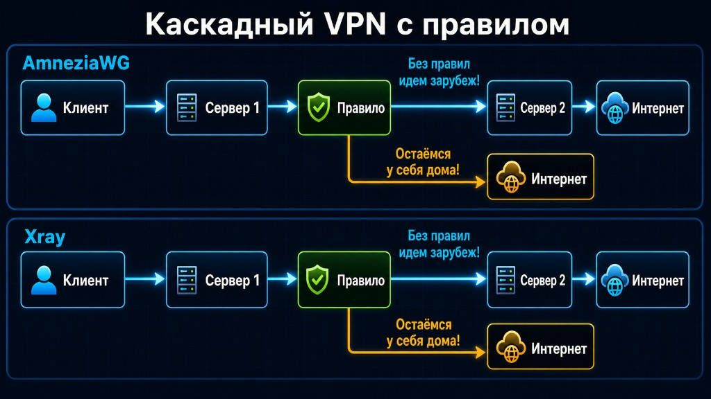

# UTMka+AWG

**Это не просто панель, а мини-экосистема для собственного личного VPN на AmneziaWG 2.0.**

Поднимите и держите свой VPN на одном или нескольких VPS, выдавайте доступ
близким, заботьтесь о приватности и стабильности соединения, при желании
делите расходы на серверы через ЮKassa и общайтесь в встроенном чате — всё из
одной панели, без ручной возни на сервере.

> **Назначение.** Проект создан для **личного использования** — для себя, семьи
> и друзей. Это инструмент приватности и удобного управления собственными
> серверами, а не сервис для перепродажи доступа. Используйте его в рамках
> законодательства вашей страны.

---

## Кому подходит

- **Для себя, семьи и друзей** — поднять надёжный личный VPN и раздать доступ
  близким за пару кликов.
- Удобно, когда нужно управлять несколькими своими серверами и устройствами
  из одного места, а расходы на VPS — по-честному делить с теми, кому раздаёте
  доступ.

Можно начать вообще без домена — панель сразу работает по `http://IP:8080`.

---

## Возможности

### 🔑 Серверы и клиенты
Подключайте несколько VPS, панель сама определит/установит AmneziaWG 2.0.
Создание профилей и выдача ключей — в пару кликов, с продлением срока,
лимитами и **накопительным учётом трафика** (счётчик не сбрасывается при
перезапуске интерфейса).

### 🛡 Приватность и стабильность соединения
Тонкая настройка параметров AmneziaWG (J/S/H/I), **ротация** порта,
keepalive и endpoint, напоминание, если настройки давно не менялись. Цель —
стабильное соединение и приватность, чтобы канал работал ровно и не накапливал
лишний «отпечаток».

### 🧅 Цепочка серверов (двойной транзит entry → exit)
Связка двух **ваших** серверов: **входной → выходной**. Гибкие правила
маршрутизации: **«локальные ресурсы — напрямую (быстрее), остальное — через
второй сервер»** (по спискам адресов). Это даёт дополнительную приватность и
не раскрывает конечный маршрут.

Каскад работает **одинаково и на AmneziaWG, и на Xray (VLESS-Reality)** —
маршрутизация серверная, поэтому правило действует для любого клиента:

<p align="center">
  
</p>

Реализовано безопасно:
- **fail-closed** — если транзит падает, трафик не «утекает» напрямую, а блокируется;
- **авто-откат** при любой ошибке или провале проверки связности;
- трафик к локальным ресурсам всегда жив (идёт через вход), даже если выход недоступен.

### 🌐 Reality / Xray как запасной канал
Если UDP-соединение работает нестабильно — панель поднимает запасной канал по
**TCP/443** (Xray/Reality) для надёжности связи.

### 💬 Чат-поддержка (мини-приложение)
Пользователь заходит по логину/паролю на ваш домен чата и получает:
- **ключи в любом формате** — AmneziaWG и AmneziaVPN: конфиг-файл, QR-код, текст;
- **счета** прямо в переписке;
- **PWA** — чат ставится на телефон или рабочий стол как настоящее приложение,
  с **push-уведомлениями** о новых сообщениях, ключах и счетах.

Со стороны администратора — все диалоги в одном окне с отметкой «ждут ответа».

### 💳 ЮKassa — удобное деление расходов
Подключите ЮKassa в настройках — и удобно делите расходы на серверы с теми,
кому раздаёте доступ, без ручной сверки:
- выставление счёта из панели (и прямо в чат), ссылка на оплату;
- панель **сама проверяет статус** платежа;
- после оплаты **автоматически продлевает** срок доступа;
- шаблоны сообщений и массовое выставление счетов.

Ключи ЮKassa хранятся в БД в зашифрованном виде.

### 🔒 Доступ по домену и HTTPS
Вход в панель по домену с настоящим сертификатом (Let's Encrypt), закрытие
прямого порта `:8080`. Если на 443 уже работает ваш VPN (Xray/Reality), панель
настроит **SNI passthrough** — VPN не отключится.

### ♻️ Надёжность «как автомат Калашникова»
Обновление — одной кнопкой; перед миграциями делается **дамп БД** и при сбое
происходит **автоматический откат кода и базы**; pre-flight проверки не дадут
запустить обновление на «сломанном» сервере.

---

## Домены: как использовать

Домен нужен, только если хотите вход по красивому адресу или клиентский чат.
Без домена всё работает по `http://IP:8080`.

### Домен для панели
1. У регистратора: **A-запись** `panel.example.com` → IP вашего VPS.
2. В панели: сервер → вкладка **«Безопасность»** → проверить DNS → выпустить
   сертификат.
3. Готово: вход по `https://panel.example.com`, а прямой `:8080` можно закрыть.

### Домен для чата
Чат живёт на **отдельном поддомене** — так клиентская часть изолирована от
админки (наружу торчит только мини-приложение, админ-API недоступно).
1. У регистратора: **A-запись** `chat.example.com` → тот же IP VPS.
2. В панели привяжите поддомен чата и выпустите сертификат.
3. Близкие заходят на `https://chat.example.com`, входят по логину/паролю,
   могут установить чат как приложение и получать push.

> Итого для полного набора: **1 домен для панели + 1 поддомен для чата**
> (например `panel.example.com` и `chat.example.com`). Можно использовать любые
> имена поддоменов.

---

## Установка на VPS — одной командой

Чистый Ubuntu/Debian, под `root`:

```bash
curl -fsSL https://raw.githubusercontent.com/Saw28rus/utmka-awg/main/scripts/install-panel.sh | sudo bash
```

Скрипт сам ставит Docker, клонирует репозиторий в `/opt/utmka-awg`, генерирует
случайные секреты в `.env`, создаёт администратора со **случайным** паролем и
поднимает всё. По завершении печатает адрес панели и одноразовый пароль.

После установки: **http://IP_ВАШЕГО_VPS:8080** (откройте порт `8080` в firewall
хостинга, если страница не открывается). Пароль показывается один раз — сохраните.

---

## Обновления

Обновление — **одной кнопкой** в панели: **Настройки → Обновить**.

- обновление идёт на помеченные релизы (semver-теги), а не на «сырой» `main`;
- перед миграциями делается **дамп БД**; при сбое — автоматический **откат кода
  и базы** к рабочему состоянию;
- pre-flight проверки (место на диске, `.env`, Docker) — обновление не начнётся,
  если что-то не так.

---

## Безопасность по умолчанию

- Все секреты — только в `.env` (права `600`, не в git).
- В production панель не стартует с дефолтными секретами (fail-fast).
- PostgreSQL не публикуется наружу.
- Секреты (ключи ЮKassa, push) шифруются в БД.

---

## Локальная разработка

```bash
cp .env.example .env
docker compose -f docker-compose.dev.yml up --build
```

- frontend: http://localhost:5173
- backend docs: http://localhost:8000/docs

> `docker-compose.dev.yml` — только для разработки (открытые порты, слабые
> дефолтные пароли). На сервере используется `docker-compose.yml` (production).

---

## Лицензия

© 2026 UTMka+AWG. Распространяется на условиях **GNU AGPL-3.0** (см. [`LICENSE`](LICENSE)).

Проект свободный, но с сильным копилефтом: если вы изменяете панель и
**предоставляете доступ к ней по сети** (как сервис), вы обязаны открыть
исходный код вашей версии пользователям. Распространение в закрытом виде
не допускается.
